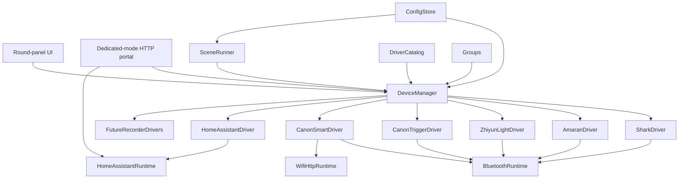

# Architecture

## Goal

Ble(e)p is a direct Bluetooth and HTTP studio controller. A project builder
selects device drivers at compile time. The operator then creates, configures,
enables, disables, groups, and controls instances of those compiled drivers at
runtime.

The existing iFootage Shark Nano II behavior remains supported.

## System model

All state mutation, command dispatch, and LVGL access remains serialized
through the Arduino `loop()`. Transport callbacks may only queue bytes or
events.

## Current foundation implementation

ADR-013 advances a bounded subset of this architecture before the transport
feasibility spikes:

- the main profile's `DriverCatalog` contains Shark Nano II, Canon Trigger,
  Canon Smart, Tascam X8, Home Assistant, and one discoverable generic Amaran
  Light entry, and one experimental multi-instance Zhiyun Light entry for
  captured MOLUS profiles;
  hidden legacy Amaran model IDs remain resolvable for persisted records;
  smaller profiles compile selected drivers out;
- `DeviceManager` owns a fixed-capacity registry, command/result queues, up to
  eight logical active instances grouped onto four physical BLE transport
  slots, per-owner lifecycle, and persistence;
- schema version 2 stores up to twelve device records in the `studio` NVS
  namespace, migrates v1 BLE records unchanged, and retains records for
  unavailable driver IDs. HA credentials/token and Amaran mesh secrets use
  separate checksummed records;
- a missing registry is initialized empty. A paired Shark from the pre-registry
  `shark` namespace is still migrated, while the untouched unpaired Shark
  placeholder created by earlier firmware is removed on upgrade;
- the catalog permits one Shark, up to three Canon Trigger instances, up to
  three Canon Smart instances, and one Tascam X8 within the eight-record
  registry;
- Home and Devices load without initializing NimBLE; the first requested BLE
  device lazily starts one shared central runtime, and the last release shuts
  it down;
- Groups and the remaining generic device-type UI remain unimplemented. The first
  GATT facade tranche (ADR-021) now centralizes scanning, async links, retries,
  address claims, security serialization, bonds, and teardown for all four BLE
  clients. Panel Scenes (ADR-019/020) provide authored Start/Stop
  sequences with concurrent Canon Smart + Tascam links. ADR-023 adds bounded
  Portal provisioning and four local HA entities. ADR-024 adds an experimental
  userspace PB-GATT/Mesh Proxy Amaran tranche. Both target hardware gates remain
  open. ADR-028 shares that panel-owned provisioning repository and PB-GATT
  engine with Zhiyun lights, then adds model-profiled direct `0xFEE9` control
  with confirmed readback;
  generated reverse-Stop and groups remain deferred.

## Compile-time driver catalog

`Kconfig.projbuild` will provide a Linux-kernel-style menu for:

- device families and individual model drivers;
- Bluetooth GATT, Bluetooth Mesh, and Wi-Fi/HTTP transports;
- scenes, dedicated Portal mode, and optional UI modules;
- memory-sensitive limits such as connection and queue counts.

Selected drivers register immutable metadata in `DriverCatalog`:

- stable driver ID, brand, model, and device type;
- required transports;
- discovery, pairing, and configuration schema;
- capabilities, commands, and state fields;
- generic UI module plus optional specialized UI extension.

Disabled drivers must not link protocol code, tasks, buffers, assets, or UI
extensions into the firmware.

## Runtime device registry

A device instance is separate from its compiled driver. It stores:

- stable instance ID and display name;
- driver ID and enabled state;
- pairing identity or HTTP endpoint;
- transport preference and fallback;
- model-specific configuration;
- group membership.

Multiple instances may use one driver. If firmware is rebuilt without a
previously used driver, its stored instance remains dormant and can reappear
when that driver is compiled back in.

Runtime disable prevents discovery, connections, polling, commands, and menu
presence. It does not recover flash or static allocations; that requires
disabling the driver in menuconfig.

## Startup and connection lifecycle

The firmware always boots to a neutral Home menu. Boot does not scan, pair,
re-pair, reconnect to Shark, or load a device control screen.

Home provides:

- Devices;
- Groups;
- Scenes;
- Portal;
- status and power controls.

Opening a device screen acquires a foreground owner for that instance. Opening
a sequence run screen acquires a sequence owner for every Start/Stop target.
Preparation reaches `Ready` only after
every target is physically connected and its driver reports protocol readiness.
The run screen shows one category-icon chip per target. A chip borrows the
already-held activation to open full device controls, then returns without
tearing down that device or its peers. Once a session reaches protocol readiness,
removing its last owner parks a healthy link in the retained pool. If that
ownerless link later drops unexpectedly, its transport is deactivated instead
of continuing background reconnect; acquiring it again starts the normal
bounded connection path. Attempts that never became ready are canceled.
When a retained instance gains a new owner, `DeviceManager` invokes the
driver's bounded resume hook before attaching that owner. Canon Smart uses this
hook to reconnect and wake a session that the panel previously powered off;
other drivers leave their retained transport unchanged.
Logical active-instance capacity is separate from physical BLE capacity. Each
driver supplies a `BleSlotKey`: ordinary GATT instances use their instance ID,
non-BLE runtimes use no key, and logical members sharing one real transport use
the same key. A new key at the four-slot limit evicts the least-recently-used
transport group only when every member of that group is idle and unprotected;
the complete group is deactivated so eviction actually frees its one central
link. The logical-instance limit may evict one idle instance independently.
Neither path evicts sequence/foreground owners, pending commands, or confirmed
recording. No device is selected or restored implicitly at boot.

### Shared BLE central

`src/core/ble/` contains a bounded backend-independent coordinator and the
NimBLE backend. Device clients acquire one link handle and retain only their
protocol policy: advertisement matching, candidate choice, GATT discovery,
subscriptions, handshakes, commands, and notification parsing.

One physical scanner fans fixed-size advertisement observations to every
interested link. It runs in four-second bursts separated by 1.5-second pauses,
with a 20/100 scan window/interval while active. Selecting a peer removes only
that subscriber's scan demand;
other preparing devices continue to receive observations. Address claims keep
two clients from selecting the same peer. Connects are asynchronous and use
independent slots with a bounded watchdog and `1500 * min(failures, 4)` retry
backoff. A saved target receives three direct attempts before rediscovery, which
avoids paying scan latency for the common case where a nearby peripheral needs
one or two radio-wakeup retries. The ESP32-C3 initiates at most one physical connection or security
procedure at a time; queued targets continue sharing discovery, and the next
link can connect while an already-linked driver's protocol initialization runs.
This avoids observed HCI `0x3e` establishment timeouts without serializing the
entire preparation pipeline. Canon security procedures are also serialized
because NimBLE security configuration is controller-global.

The central tracks physical connection separately from protocol readiness and
clears readiness on retry, failure, release, and reconnect. Drivers publish
readiness only after their final required subscription, identity/session write,
handshake, and initial refresh has succeeded. Connection setup is scheduled on
the next main-loop pass so queued link events can drain first. Drivers request
targeted service/characteristic/descriptor discovery rather than full attribute
walks. The backend also makes best-effort connection-parameter requests: 7.5–15
ms during setup and 30–50 ms after protocol readiness; rejection is diagnostic
and non-fatal.

The NimBLE controller is initialized with the compile-time
`CONFIG_BLE_TX_POWER_DBM` setting. The shared configuration defaults to +6 dBm
rather than leaving the value implicit; builds may select another value from -24
through 20 dBm when their range/current trade-off requires it. NimBLE maps the
request to a radio-supported level. These radio policies reduce average and
peak demand but are not electrical protection for the CrowPanel battery-input
path.

Serial-only `ble_timing` records cover activation, scan/direct connect, link,
security, GATT setup, protocol readiness, retries, teardown, and total sequence
preparation. A shared asynchronous GATT executor remains conditional: implement
it only if ten-cycle hardware measurements show blocking GATT work consumes at
least 25% of median readiness time for any driver or the concurrent Canon Smart
+ Tascam pair. Until that gate is met, UUID selection and GATT sequencing remain
driver-owned under ADR-021.

NimBLE host callbacks only enqueue fixed-size scan/link/security events.
`loopBleRuntime(now)` drains them before `DeviceManager::loop()`, so matching,
state mutation, GATT setup/writes, and all LVGL access remain on the main loop.
The first acquired link initializes `Ble(e)p` with MTU 247; releasing the last
link begins client deletion and deinitializes NimBLE only after asynchronous
client teardown has actually emptied NimBLE's global slots. An immediate
reacquire can reserve links during that interval; the backend provisions their
replacement clients as capacity returns. Backend callback objects have backend
lifetime rather than link lifetime, and final GAP events are accepted only when
their client pointer still owns the logical slot.

## Capabilities and unified UI

Shared device-type UI modules consume capabilities rather than brand-specific
state:

- `light`: power, brightness, CCT, tint, HSI;
- `camera`: record start/stop, recording state, and later camera controls;
- `motion`: run, stop, progress, keypoints, and manual movement;
- `recorder`: record start/stop, recording state, battery, and media status.
- `switch`: explicit on/off with confirmed state;
- `action`: explicit Press or Activate with no inferred toggle/value action;
- `input_boolean`: explicit On/Off commands with one context-sensitive entity
  button that sends the opposite of the last confirmed state.

Home Assistant is the first dynamic-profile driver: each persistent instance
derives its device type and capabilities from its stored entity domain rather
than the driver's catalog row. Device pickers, scene validation, and command
selection query this instance profile. Four HA instances share one retained
network runtime and do not consume the four physical BLE link slots.

### Home Assistant Portal and runtime

Portal suspends scenes and physical links. If studio Wi-Fi is not configured or
cannot be joined, it starts a temporary WPA2 SoftAP and a SoftAP-bound page that
offers a bounded asynchronous Wi-Fi scan and manual SSID/password entry. The
panel's QR code contains the temporary WPA2 network credentials. While the AP
is active, wildcard DNS and unknown-path redirects provide best-effort captive
portal discovery so phones can present the setup page as a sign-on screen.
The join is a main-loop state machine, leaving HTTP and LVGL responsive while the
browser and panel report scanning, connecting, success, timeout, missing SSID,
or rejected credentials. A successful join saves those credentials, exposes
the assigned numeric LAN address during a bounded handoff, destroys the AP,
binds a new listener to the station address, and advertises a best-effort
`http://bleep.local` mDNS alias. The responsive LAN console serves overview,
committed-device administration, current authored Start/Stop sequence editing,
and HA setup. Physical pairing, device commands, and sequence execution are
deliberately absent. Discovery incrementally parses `/api/states`; the browser
receives at most 24 bounded summaries and may select four. Secrets are password
fields and never appear in `/api/config`. Exit or ten minutes of inactivity
stops HTTP/mDNS, disconnects STA, and returns Wi-Fi to off.

Opening an HA screen or preparing an HA scene target acquires the shared
`HomeAssistantRuntime`. It joins Wi-Fi, authenticates `/api/websocket`, fetches
each active entity's initial state through REST, and installs a
`subscribe_trigger` state subscription containing only active entity IDs.
Callbacks copy at most two 2048-byte frames; the main loop parses them with
ArduinoJson, mutates state, sends service calls, and updates LVGL. Malformed,
oversized, or dropped frames mark state unknown and schedule a bounded REST
refresh. When a subscribed confirmation has not arrived after five seconds,
the runtime reconciles the individual entity through REST before reporting
failure. A matching refreshed state succeeds; only HTTP 404 means missing,
while transport and parse failures remain unknown. The runtime disconnects
Wi-Fi after its final HA instance is evicted or explicitly unlinked.

Mixed sequences initialize every physical transport before acquiring any Home
Assistant target, independent of authored action order. On the ESP32-C3,
NimBLE initialization requires a contiguous allocation of roughly `0x7800`
bytes; starting Wi-Fi first can fragment/deplete the heap and causes the
underlying BLE library to assert instead of returning a recoverable error.
Before that ordering pass, preparation evicts every idle retained HA session so
navigation from an HA entity cannot leave Wi-Fi consuming the BLE allocation.
Pending HA work makes preparation fail safely. Action execution still follows
the authored order after all targets prepare. The LVGL pool is held to 76 KiB
and the target keeps two 15-row DMA display strips, returning 47.2 KiB of
static SRAM compared with the earlier 96 KiB/40-row configuration. The full
simulator flow is the regression gate for the LVGL allocation budget. HA keeps
two 2 KiB WebSocket frame slots; oversized state events intentionally become
unknown and use the individual REST recovery path. A WebSocket disconnect is
reported to the main loop as a flag, where authentication and subscription
state are cleared and a bounded reconnect is scheduled.
Transient failures while resolving an entity's initial REST state do not leave
protocol readiness permanently false: one entity is retried at a time after a
two-second delay. HTTP 404 remains a terminal missing-entity result; transport,
other HTTP, and malformed JSON results remain unknown and retry.

Drivers publish limits and availability. For example, a CCT-only light does
not expose HSI controls. Specialized workflows such as Shark keypoints may
extend the common motion UI without leaking into other drivers.

### UI allocation optimization

Home and the Devices shell remain resident. Device rows, device screens,
management overlays, and keyboards are created on entry and deleted after
navigation leaves them.
Device and transport state remains owned outside LVGL so destroying a view
never discards protocol state.

Canon (Smart) and Tascam share `src/ui/recorder_shell.*`, driven by a small
view model and typed command callbacks. The shared shell provides connection,
recording, transition, confirmation, and failure states; driver adapters add
optional controls such as Canon's explicit power button or dual Start/Stop
controls for unknown state. Shark retains specialized keypoint and motion
views, and creates only the connect screen plus connected screens/overlays
while active.

Devices **Add device** and Scenes **+ Step** share `src/ui/picker_shell.*`: a
category icon grid, then a driver or enabled-device list, then (for scene
steps) Record Start / Stop. The overlay is created on open and deleted on
close.

The sequence run screen reuses the same category icons in circular target
chips. Their borders breathe cyan during connection/protocol setup, stay green
when protocol-ready, turn red after a terminal connection failure, and remain
muted gray when simply disconnected or powered off. Chip navigation is disabled
while Start or Stop steps execute; a compact status label remains above
Cancel/Done.

The CrowPanel vibration motor is driven by PI4IOE5V6408 expander output P0. A
shared main-loop sequencer provides four semantic patterns: Press is one 20 ms
tap; Connected is 12 ms on, 24 ms off, then 12 ms on; Back is 15 ms on, 35 ms
off, then 30 ms on; Error is 60 ms on, 45 ms off, then 60 ms on. LVGL's input
feedback callback requests Press only after a click is accepted, and navigation
handlers replace that generic pulse with Back. Connected fires when the current
device becomes protocol-ready, when an already-ready retained device is opened,
or when sequence preparation reaches `ScenePhase::Ready`; it queues behind a
stronger active pattern. Foreground command failures, pending-add save failures,
sequence failures, and terminal Portal errors request Error only on their
transition into failure.
Stronger patterns take priority, and no pattern delays UI, transport, or scene
work.

The twelve-record Devices screen plus the largest specialized control screen
exhausted the earlier 64 KiB LVGL pool. The final 76 KiB pool passes the full
capture run and retains 14,192 bytes on its most demanding sequence-stop
screen; 72 KiB was measured and rejected after stalling the simulator after
the Shark run screen. Target heap recovery remains part of ADR-023's open
hardware gate.

State fields carry a quality:

- `unknown`: no usable value;
- `optimistic`: inferred from a command without readback;
- `confirmed`: observed from the device.

## Groups

Groups are named collections of runtime instances. A group exposes only the
capabilities common to all enabled members. Commands fan out and retain a
result for every member.

Groups are valid scene targets. An incompatible or unavailable group action is
rejected during scene validation.

## Bluetooth architecture

GATT is accessed through a transport facade:

- all current BLE builds use one lazy NimBLE central;
- Shark, Canon, and Tascam use their device-specific GATT services;
- Amaran and Zhiyun lights share one panel-owned mesh repository, durable unicast
  allocator, and userspace no-OOB PB-GATT provisioner over that central;
- the mesh runtime owns one retained proxy client. It exposes standard Mesh
  Proxy Data In/Out to Amaran/Aputure access messages and lets saved Zhiyun
  sessions attach their separate `0xFEE9` characteristics to that same native
  client;
- `DeviceManager` charges the complete panel-owned Amaran/Aputure/Zhiyun mesh one
  `BleSlotKey`, so adding or retaining another member does not consume another
  one of the four physical slots;
- the generic, multi-instance Zhiyun driver accepts reset or provisioned
  product-qualified `pl105` X100 and `plx104` X60RGB advertisements. It uses
  PB-GATT when provisioning is required, rediscovers the Mesh Proxy advertiser,
  then initializes and controls the separate `0xFEE9` GATT service. Its writes
  remain pending until correlated device replies confirm the requested values.
  Saved members persist a routing selector and share one gateway notification
  stream; unique transport sequences keep concurrent replies attributable;
- PB-GATT onboarding is a temporary exclusive link. After a saved node is
  reopened, steady-state control attaches to the shared proxy bearer rather
  than allocating another central slot;
- callbacks enqueue only bounded events or raw bytes; mesh crypto, parsing,
  persistence, and writes remain on the main loop.

Concurrent Amaran proxy, Shark/Canon/Tascam GATT, provisioning recovery, and
post-teardown heap remain an ESP32-C3 hardware feasibility gate.

## Dedicated Portal mode

The administration server does not run during normal operation.

Entering Portal mode:

1. refuses entry or requests confirmation if a scene is active;
2. suspends device connections;
3. joins saved studio Wi-Fi, or starts a temporary WPA2 SoftAP whose page
   collects only Wi-Fi credentials, with an on-panel Wi-Fi QR code and
   AP-scoped captive-portal discovery;
4. after joining, shows the numeric station address, closes the AP, and binds
   the bounded HTTP server there with `bleep.local` as best-effort discovery,
   and changes the QR code to the numeric Portal URL;
5. displays the active network, URL, timeout, and Exit on the panel.

The LAN listener exposes bounded JSON APIs for summary, device records,
sequences, and HA configuration. Each session has a fresh mutation nonce;
state-changing requests without it are rejected, CORS is not enabled, and the
page is served with no-store and frame-denial headers. Device and sequence
changes pass through their normal registries, validation, and checked NVS
writes. Failed persistence restores the prior in-memory state, stale sequence
revisions are rejected, and referenced devices cannot be removed. Records for
drivers omitted from the current build remain visible but unavailable.

Exiting Portal mode, reaching the inactivity timeout, or rebooting destroys the
HTTP server, mDNS responder, SoftAP, and station connection before restoring
normal operation. Teardown tests must verify that no listener, AP, server task,
or portal buffer remains active.

Canon CCAPI is unavailable in Portal mode because normal station-mode control
is intentionally suspended. The portal is exposed on the trusted studio LAN
only for the lifetime of the active Portal screen.

## Local settings and support information

Home adds a cog without replacing Devices, Groups, Scenes, or Portal. Settings
and its Wi-Fi, About, System Info, and Factory Reset views are created on entry
and destroyed on exit. The Wi-Fi view reads only the saved SSID and accurately
labels the normal state as radio-off; configuration transfers to dedicated
Portal mode before any network resources start.

About is the first Settings item. The menu and About body scroll independently
within round-safe page regions, while Factory Reset remains a distinct top-level
menu item. Destructive styling appears only after it opens the separate warning
and hold-confirmation view.

Haptic enablement is a separate checked NVS record and gates the shared
non-blocking sequencer without changing its semantic patterns. About embeds a
small LVGL logo and build identity. System Info samples heap, largest
allocation, minimum heap, physical BLE groups, and Wi-Fi mode on the main loop
without exposing secrets or stable device identifiers.

Factory Reset is deliberately stronger than clearing an individual registry.
After a three-second hold it cancels work, deactivates transports, erases the
complete NVS partition (including BLE bonds and mesh identity), and reboots.
The application partition and installed firmware remain untouched.

## Persistence

Versioned persistent records cover:

- Wi-Fi credentials and Canon endpoints;
- runtime device instances and groups;
- Amaran mesh identity and keys;
- scenes and execution metadata;
- schema version and migration status.
- panel preferences such as haptic enablement.

Secrets are masked in UI and logs. Backups exclude keys and credentials unless
the operator explicitly requests a protected full export.
