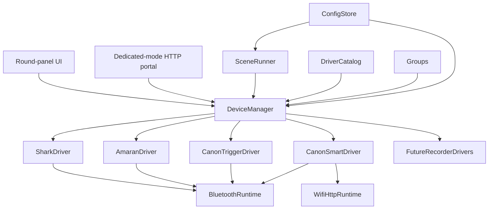

# Architecture

## Goal

The firmware is a direct Bluetooth and HTTP studio remote. A project builder
selects device drivers at compile time. The operator then creates, configures,
enables, disables, groups, and controls instances of those compiled drivers at
runtime.

The existing iFootage Shark Nano II behavior remains supported.

## System model

All state mutation, command dispatch, and LVGL access remains serialized
through the Arduino `loop()`. Transport callbacks may only queue bytes or
events.

## Current foundation implementation

ADR-013 advances a bounded subset of this architecture before the transport
feasibility spikes:

- `DriverCatalog` currently contains only `ifootage.shark_nano_ii`;
- `DeviceManager` owns a fixed-capacity registry, command/result queues, active
  driver lifecycle, and persistence;
- schema version 1 stores up to eight device records in the `studio` NVS
  namespace and retains records for unavailable driver IDs;
- the Shark descriptor permits one instance in the current build;
- Home and Devices load without initializing NimBLE; selecting the enabled
  Shark instance activates its transport, and leaving releases it;
- Groups, Portal, generic device-type UI, and the GATT facade remain
  unimplemented. Panel Scenes (ADR-019/020) provide authored Start/Stop
  sequences with concurrent Canon Smart + Tascam links; generated reverse-Stop,
  groups, lights, and Portal editing remain deferred.

## Compile-time driver catalog

`Kconfig.projbuild` will provide a Linux-kernel-style menu for:

- device families and individual model drivers;
- Bluetooth GATT, Bluetooth Mesh, and Wi-Fi/HTTP transports;
- scenes, dedicated Portal mode, and optional UI modules;
- memory-sensitive limits such as connection and queue counts.

Selected drivers register immutable metadata in `DriverCatalog`:

- stable driver ID, brand, model, and device type;
- required transports;
- discovery, pairing, and configuration schema;
- capabilities, commands, and state fields;
- generic UI module plus optional specialized UI extension.

Disabled drivers must not link protocol code, tasks, buffers, assets, or UI
extensions into the firmware.

## Runtime device registry

A device instance is separate from its compiled driver. It stores:

- stable instance ID and display name;
- driver ID and enabled state;
- pairing identity or HTTP endpoint;
- transport preference and fallback;
- model-specific configuration;
- group membership.

Multiple instances may use one driver. If firmware is rebuilt without a
previously used driver, its stored instance remains dormant and can reappear
when that driver is compiled back in.

Runtime disable prevents discovery, connections, polling, commands, and menu
presence. It does not recover flash or static allocations; that requires
disabling the driver in menuconfig.

## Startup and connection lifecycle

The firmware always boots to a neutral Home menu. Boot does not scan, pair,
re-pair, reconnect to Shark, or load a device control screen.

Home provides:

- Devices;
- Groups;
- Scenes;
- Portal;
- status and power controls.

Opening a device screen requests that instance's connection. Launching a scene
requests only the devices needed by the scene. Leaving a screen may retain a
healthy connection according to the connection policy, but no device is
selected implicitly at boot.

## Capabilities and unified UI

Shared device-type UI modules consume capabilities rather than brand-specific
state:

- `light`: power, brightness, CCT, tint, HSI;
- `camera`: record start/stop, recording state, and later camera controls;
- `motion`: run, stop, progress, keypoints, and manual movement;
- `recorder`: record start/stop, recording state, battery, and media status.

Drivers publish limits and availability. For example, a CCT-only light does
not expose HSI controls. Specialized workflows such as Shark keypoints may
extend the common motion UI without leaking into other drivers.

### UI allocation optimization

Home and Devices remain resident. Device screens, management overlays, and
keyboards are created on entry and deleted after navigation leaves them.
Device and transport state remains owned outside LVGL so destroying a view
never discards protocol state.

Canon (Smart) and Tascam share `src/ui/recorder_shell.*`, driven by a small
view model and typed command callbacks. The shared shell provides connection,
recording, transition, confirmation, and failure states; driver adapters add
optional controls such as Canon's explicit power button or dual Start/Stop
controls for unknown state. Shark retains specialized keypoint and motion
views, and creates only the connect screen plus connected screens/overlays
while active.

Devices **Add device** and Scenes **+ Step** share `src/ui/picker_shell.*`: a
category icon grid, then a driver or enabled-device list, then (for scene
steps) Record Start / Stop. The overlay is created on open and deleted on
close.

After simulator measurements of peak use and fragmentation, the LVGL pool was
reduced from 128 KiB to 64 KiB to return static RAM to the general heap.

State fields carry a quality:

- `unknown`: no usable value;
- `optimistic`: inferred from a command without readback;
- `confirmed`: observed from the device.

## Groups

Groups are named collections of runtime instances. A group exposes only the
capabilities common to all enabled members. Commands fan out and retain a
result for every member.

Groups are valid scene targets. An incompatible or unavailable group action is
rejected during scene validation.

## Bluetooth architecture

GATT is accessed through a transport facade:

- GATT-only builds use NimBLE to minimize memory;
- Amaran-enabled builds require an ESP-IDF Bluetooth Mesh/GATT backend;
- Shark and Canon BR-E1 use GATT;
- Amaran uses PB-ADV provisioning and mesh traffic.

Direct Amaran provisioning plus concurrent Shark/Canon GATT is a feasibility
gate. It must be proven on the ESP32-C3 before the main refactor depends on it.

## Dedicated Portal mode

The administration server does not run during normal operation.

Entering Portal mode:

1. refuses entry or requests confirmation if a scene is active;
2. suspends device connections and leaves the studio Wi-Fi station;
3. starts a temporary WPA2 SoftAP with a per-session credential;
4. starts the bounded HTTP server on the AP interface;
5. displays SSID, password, URL, timeout, and Exit on the panel.

Exiting Portal mode, reaching the inactivity timeout, or rebooting destroys the
HTTP server and SoftAP before restoring normal operation. Teardown tests must
verify that no listener, AP, server task, or portal buffer remains active.

Canon CCAPI is unavailable in Portal mode because normal station-mode control
is intentionally suspended. The portal is not exposed on the studio LAN.

## Persistence

Versioned persistent records cover:

- Wi-Fi credentials and Canon endpoints;
- runtime device instances and groups;
- Amaran mesh identity and keys;
- scenes and execution metadata;
- schema version and migration status.

Secrets are masked in UI and logs. Backups exclude keys and credentials unless
the operator explicitly requests a protected full export.

