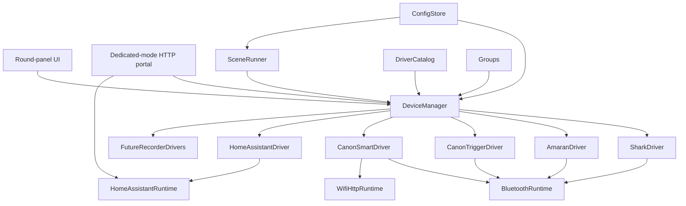

# Architecture

## Goal

Ble(e)p is a direct Bluetooth and HTTP studio controller. A project builder
selects device drivers at compile time. The operator then creates, configures,
enables, disables, groups, and controls instances of those compiled drivers at
runtime.

The existing iFootage Shark Nano II behavior remains supported.

## System model

All state mutation, command dispatch, and LVGL access remains serialized
through the Arduino `loop()`. Transport callbacks may only queue bytes or
events.

## Current foundation implementation

ADR-013 advances a bounded subset of this architecture before the transport
feasibility spikes:

- the main profile's `DriverCatalog` contains Shark Nano II, Canon Trigger,
  Canon Smart, Tascam X8, and Home Assistant; smaller profiles compile selected
  drivers out;
- `DeviceManager` owns a fixed-capacity registry, command/result queues, a
  four-session retained connection pool, per-owner lifecycle, and persistence;
- schema version 2 stores up to twelve device records in the `studio` NVS
  namespace, migrates v1 BLE records unchanged, and retains records for
  unavailable driver IDs. HA credentials and token use a separate checksummed
  `ha_config` record;
- the catalog permits one Shark, up to three Canon Trigger instances, up to
  three Canon Smart instances, and one Tascam X8 within the eight-record
  registry;
- Home and Devices load without initializing NimBLE; the first requested BLE
  device lazily starts one shared central runtime, and the last release shuts
  it down;
- Groups and the remaining generic device-type UI remain unimplemented. The first
  GATT facade tranche (ADR-021) now centralizes scanning, async links, retries,
  address claims, security serialization, bonds, and teardown for all four BLE
  clients. Panel Scenes (ADR-019/020) provide authored Start/Stop
  sequences with concurrent Canon Smart + Tascam links. ADR-023 adds bounded
  Portal provisioning and four local HA entities; its target hardware gate is
  still open. Generated reverse-Stop, groups, and native BLE lights remain
  deferred.

## Compile-time driver catalog

`Kconfig.projbuild` will provide a Linux-kernel-style menu for:

- device families and individual model drivers;
- Bluetooth GATT, Bluetooth Mesh, and Wi-Fi/HTTP transports;
- scenes, dedicated Portal mode, and optional UI modules;
- memory-sensitive limits such as connection and queue counts.

Selected drivers register immutable metadata in `DriverCatalog`:

- stable driver ID, brand, model, and device type;
- required transports;
- discovery, pairing, and configuration schema;
- capabilities, commands, and state fields;
- generic UI module plus optional specialized UI extension.

Disabled drivers must not link protocol code, tasks, buffers, assets, or UI
extensions into the firmware.

## Runtime device registry

A device instance is separate from its compiled driver. It stores:

- stable instance ID and display name;
- driver ID and enabled state;
- pairing identity or HTTP endpoint;
- transport preference and fallback;
- model-specific configuration;
- group membership.

Multiple instances may use one driver. If firmware is rebuilt without a
previously used driver, its stored instance remains dormant and can reappear
when that driver is compiled back in.

Runtime disable prevents discovery, connections, polling, commands, and menu
presence. It does not recover flash or static allocations; that requires
disabling the driver in menuconfig.

## Startup and connection lifecycle

The firmware always boots to a neutral Home menu. Boot does not scan, pair,
re-pair, reconnect to Shark, or load a device control screen.

Home provides:

- Devices;
- Groups;
- Scenes;
- Portal;
- status and power controls.

Opening a device screen acquires a foreground owner for that instance. Opening
a sequence run screen acquires a sequence owner for every Start/Stop target.
Preparation reaches `Ready` only after
every target is physically connected and its driver reports protocol readiness.
The run screen shows one category-icon chip per target. A chip borrows the
already-held activation to open full device controls, then returns without
tearing down that device or its peers. Once a session reaches protocol readiness,
removing its last owner parks it in the retained pool and bounded reconnect
continues after unexpected drops. Attempts that never became ready are canceled.
The active-instance pool evicts only the least-recently-used idle and
unprotected session; it
never evicts sequence/foreground owners, pending commands, or confirmed
recording. No device is selected or restored implicitly at boot.

### Shared BLE central

`src/core/ble/` contains a bounded backend-independent coordinator and the
NimBLE backend. Device clients acquire one link handle and retain only their
protocol policy: advertisement matching, candidate choice, GATT discovery,
subscriptions, handshakes, commands, and notification parsing.

One physical active scanner fans fixed-size advertisement observations to every
interested link. Selecting a peer removes only that subscriber's scan demand;
other preparing devices continue to receive observations. Address claims keep
two clients from selecting the same peer. Connects are asynchronous and use
independent slots with a bounded watchdog and `1500 * min(failures, 4)` retry
backoff. A saved target receives three direct attempts before rediscovery, which
avoids paying scan latency for the common case where a nearby peripheral needs
one or two radio-wakeup retries. The ESP32-C3 initiates at most one physical connection or security
procedure at a time; queued targets continue sharing discovery, and the next
link can connect while an already-linked driver's protocol initialization runs.
This avoids observed HCI `0x3e` establishment timeouts without serializing the
entire preparation pipeline. Canon security procedures are also serialized
because NimBLE security configuration is controller-global.

The central tracks physical connection separately from protocol readiness and
clears readiness on retry, failure, release, and reconnect. Drivers publish
readiness only after their final required subscription, identity/session write,
handshake, and initial refresh has succeeded. Connection setup is scheduled on
the next main-loop pass so queued link events can drain first. Drivers request
targeted service/characteristic/descriptor discovery rather than full attribute
walks. The backend also makes best-effort connection-parameter requests: 7.5–15
ms during setup and 15–30 ms after protocol readiness; rejection is diagnostic
and non-fatal.

Serial-only `ble_timing` records cover activation, scan/direct connect, link,
security, GATT setup, protocol readiness, retries, teardown, and total sequence
preparation. A shared asynchronous GATT executor remains conditional: implement
it only if ten-cycle hardware measurements show blocking GATT work consumes at
least 25% of median readiness time for any driver or the concurrent Canon Smart
+ Tascam pair. Until that gate is met, UUID selection and GATT sequencing remain
driver-owned under ADR-021.

NimBLE host callbacks only enqueue fixed-size scan/link/security events.
`loopBleRuntime(now)` drains them before `DeviceManager::loop()`, so matching,
state mutation, GATT setup/writes, and all LVGL access remain on the main loop.
The first acquired link initializes `Ble(e)p` with MTU 247; releasing the last
link begins client deletion and deinitializes NimBLE only after asynchronous
client teardown has actually emptied NimBLE's global slots. An immediate
reacquire can reserve links during that interval; the backend provisions their
replacement clients as capacity returns. Backend callback objects have backend
lifetime rather than link lifetime, and final GAP events are accepted only when
their client pointer still owns the logical slot.

## Capabilities and unified UI

Shared device-type UI modules consume capabilities rather than brand-specific
state:

- `light`: power, brightness, CCT, tint, HSI;
- `camera`: record start/stop, recording state, and later camera controls;
- `motion`: run, stop, progress, keypoints, and manual movement;
- `recorder`: record start/stop, recording state, battery, and media status.
- `switch`: explicit on/off with confirmed state;
- `action`: explicit Press or Activate with no inferred toggle/value action;
- `input_boolean`: explicit On/Off commands with one context-sensitive entity
  button that sends the opposite of the last confirmed state.

Home Assistant is the first dynamic-profile driver: each persistent instance
derives its device type and capabilities from its stored entity domain rather
than the driver's catalog row. Device pickers, scene validation, and command
selection query this instance profile. Four HA instances share one retained
network runtime and do not consume the four physical BLE link slots.

### Home Assistant Portal and runtime

Portal suspends scenes and physical links. If studio Wi-Fi is not configured or
cannot be joined, it starts a temporary WPA2 SoftAP and a SoftAP-bound page that
offers a bounded asynchronous Wi-Fi scan and manual SSID/password entry. The
join is a main-loop state machine, leaving HTTP and LVGL responsive while the
browser and panel report scanning, connecting, success, timeout, missing SSID,
or rejected credentials. A successful join saves those credentials, exposes
the assigned numeric LAN address during a bounded handoff, destroys the AP,
binds a new listener to the station address, and advertises a best-effort
`http://bleep.local` mDNS alias. HA URL/token/entity setup is served only on that
LAN listener. Discovery incrementally parses `/api/states`; the browser
receives at most 24 bounded summaries and may select four. Secrets are password
fields and never appear in `/api/config`. Exit or ten minutes of inactivity
stops HTTP/mDNS, disconnects STA, and returns Wi-Fi to off.

Opening an HA screen or preparing an HA scene target acquires the shared
`HomeAssistantRuntime`. It joins Wi-Fi, authenticates `/api/websocket`, fetches
each active entity's initial state through REST, and installs a
`subscribe_trigger` state subscription containing only active entity IDs.
Callbacks copy at most two 4096-byte frames; the main loop parses them with
ArduinoJson, mutates state, sends service calls, and updates LVGL. Malformed,
oversized, or dropped frames mark state unknown and schedule a bounded REST
refresh. When a subscribed confirmation has not arrived after five seconds,
the runtime reconciles the individual entity through REST before reporting
failure. A matching refreshed state succeeds; only HTTP 404 means missing,
while transport and parse failures remain unknown. The runtime disconnects
Wi-Fi after its final HA instance is evicted or explicitly unlinked.

Drivers publish limits and availability. For example, a CCT-only light does
not expose HSI controls. Specialized workflows such as Shark keypoints may
extend the common motion UI without leaking into other drivers.

### UI allocation optimization

Home and Devices remain resident. Device screens, management overlays, and
keyboards are created on entry and deleted after navigation leaves them.
Device and transport state remains owned outside LVGL so destroying a view
never discards protocol state.

Canon (Smart) and Tascam share `src/ui/recorder_shell.*`, driven by a small
view model and typed command callbacks. The shared shell provides connection,
recording, transition, confirmation, and failure states; driver adapters add
optional controls such as Canon's explicit power button or dual Start/Stop
controls for unknown state. Shark retains specialized keypoint and motion
views, and creates only the connect screen plus connected screens/overlays
while active.

Devices **Add device** and Scenes **+ Step** share `src/ui/picker_shell.*`: a
category icon grid, then a driver or enabled-device list, then (for scene
steps) Record Start / Stop. The overlay is created on open and deleted on
close.

The sequence run screen reuses the same category icons in circular target
chips. Their borders breathe cyan during connection/protocol setup, stay green
when protocol-ready, turn red after a terminal connection failure, and remain
muted gray when simply disconnected or powered off. Chip navigation is disabled
while Start or Stop steps execute; a compact status label remains above
Cancel/Done.

The twelve-record Devices screen plus the largest specialized control screen
exhausted the earlier 64 KiB LVGL pool. The HA capacity simulation therefore
sets the pool to 96 KiB; the full capture run leaves about 34 KiB free at the
Shark screen checkpoint. Target heap recovery remains part of ADR-023's open
hardware gate.

State fields carry a quality:

- `unknown`: no usable value;
- `optimistic`: inferred from a command without readback;
- `confirmed`: observed from the device.

## Groups

Groups are named collections of runtime instances. A group exposes only the
capabilities common to all enabled members. Commands fan out and retain a
result for every member.

Groups are valid scene targets. An incompatible or unavailable group action is
rejected during scene validation.

## Bluetooth architecture

GATT is accessed through a transport facade:

- GATT-only builds use NimBLE to minimize memory;
- Amaran-enabled builds require an ESP-IDF Bluetooth Mesh/GATT backend;
- Shark and Canon BR-E1 use GATT;
- Amaran uses PB-ADV provisioning and mesh traffic.

Direct Amaran provisioning plus concurrent Shark/Canon GATT is a feasibility
gate. It must be proven on the ESP32-C3 before the main refactor depends on it.

## Dedicated Portal mode

The administration server does not run during normal operation.

Entering Portal mode:

1. refuses entry or requests confirmation if a scene is active;
2. suspends device connections;
3. joins saved studio Wi-Fi, or starts a temporary WPA2 SoftAP whose page
   collects only Wi-Fi credentials;
4. after joining, shows the numeric station address, closes the AP, and binds
   the bounded HTTP server there with `bleep.local` as best-effort discovery;
5. displays the active network, URL, timeout, and Exit on the panel.

Exiting Portal mode, reaching the inactivity timeout, or rebooting destroys the
HTTP server, mDNS responder, SoftAP, and station connection before restoring
normal operation. Teardown tests must verify that no listener, AP, server task,
or portal buffer remains active.

Canon CCAPI is unavailable in Portal mode because normal station-mode control
is intentionally suspended. The portal is exposed on the trusted studio LAN
only for the lifetime of the active Portal screen.

## Persistence

Versioned persistent records cover:

- Wi-Fi credentials and Canon endpoints;
- runtime device instances and groups;
- Amaran mesh identity and keys;
- scenes and execution metadata;
- schema version and migration status.

Secrets are masked in UI and logs. Backups exclude keys and credentials unless
the operator explicitly requests a protected full export.
