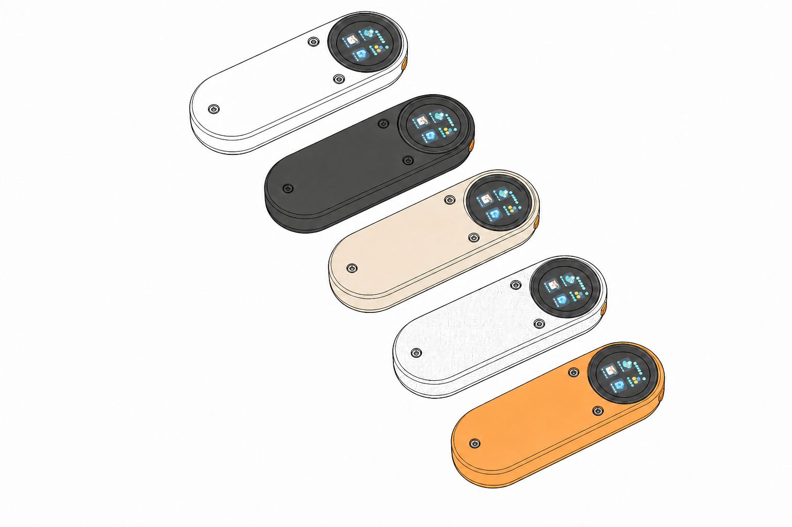
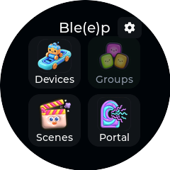
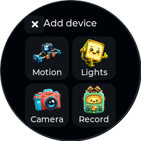
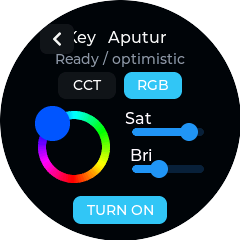
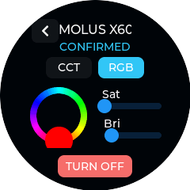
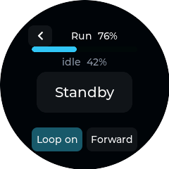
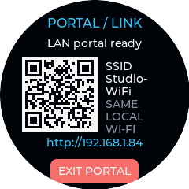
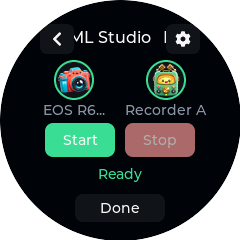
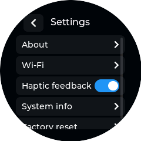
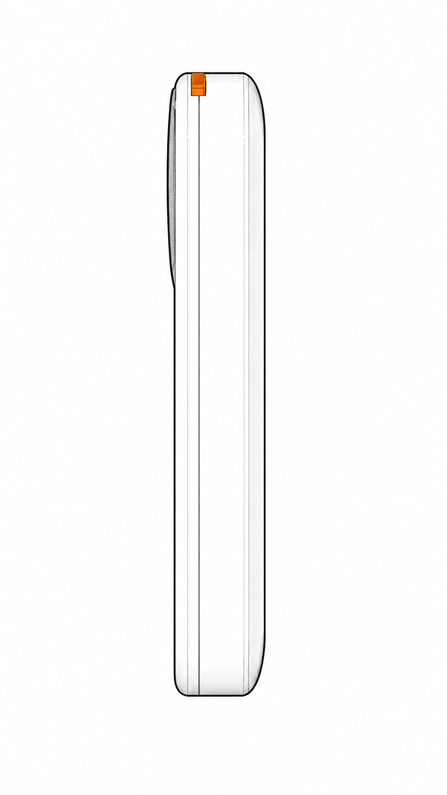

# Welcome

Ble(e)p puts the controls you need during a shoot in one small, touch-first remote. Use it to move a slider, roll cameras and audio, set lights, trigger a phone, call Home Assistant actions, or start several of them in a repeatable sequence. Its playful name means **Bluetooth Links Everything, Eventually, Probably**; the practical expansion is **Bluetooth Low Energy Equipment Panel**.

{width=6.4}

> Ble(e)p is still in development. Check the support status for your exact equipment before relying on it for paid or unrepeatable work. When Ble(e)p says **Sent** but cannot confirm the result, check the camera, recorder, light, or slider itself.

## What this manual covers

- getting from power-on to your first controlled device;
- adding, managing, reconnecting, and removing devices;
- using every control available on the device;
- building and running Start/Stop sequences;
- configuring the temporary Portal and local Home Assistant control;
- checking exact device compatibility and confidence levels;
- troubleshooting and safely resetting the controller;
- printing, assembling, repairing, and developing the project in the final advanced section.

## Status words used here

| Label | Meaning |
| --- | --- |
| Supported | Used repeatedly with the exact named model for the functions listed. |
| Experimental | Available, but some important real-world or recovery testing is still unfinished. |
| Candidate | Ble(e)p may work with this model, but that exact combination has not been tested. |
| Research | Listed for investigation only; normal control is not available. |
| Later | Not available in this version. |

# Quick start

Ble(e)p starts at Home and waits for you. It does not scan, reconnect, open a device, or start Wi-Fi by itself, so powering it on will not unexpectedly wake studio equipment.

1. Turn on the controller with its hardware power switch.
2. From Home, open **Devices**.
3. Open a saved device, or choose **Add device** and follow the pairing instructions for your equipment.
4. Wait for **Ready** before sending a command.
5. Use the on-screen control or the optional action button.
6. Check the real camera, recorder, light, or slider whenever Ble(e)p reports **Sent**, **Optimistic**, or **Unknown**.
7. Select Back or Done when finished. Use **Manage > Disconnect** only when you need to release the connection immediately.

## Your controls

| Control | Short action | Long action |
| --- | --- | --- |
| Touchscreen | Select cards, buttons, tabs, fields, devices, steps, and controls. Drag scrollable lists. | Where a screen offers a hold-to-confirm control, keep touching it for the displayed duration. |
| Action Button | Runs the main action on the current screen. In a sequence, it starts from Ready and stops after the sequence is armed. On supported equipment screens, it performs the main displayed action. | Hold for about three-quarters of a second to go Back, cancel, or close a pop-up. Keep holding for two seconds to return Home. |
| Hardware power switch | Turns Ble(e)p on or off. | The Action Button does not control power. |

## Action Button by screen

This table describes a short press. The action runs only when the corresponding on-screen control is available.

| Screen | Short press |
| --- | --- |
| Home, Devices, Add device, Manage, Settings, Portal, and pop-ups | No action. Use the touchscreen. |
| Canon - Trigger Mode | Sends the movie trigger, which starts or stops recording without reading the camera's state. |
| Canon - Smart Phone Mode | Starts recording unless the camera has confirmed that it is already recording; then it stops. Select camera power on-screen. |
| GoPro | Runs Record Start/Stop; select the on-screen power icon to sleep or wake the camera. |
| Phone Camera | Sends the shutter command. |
| Insta360 | Runs Record Start while video is idle or Record Stop while recording. It does nothing while the camera reports photo mode or while recording state is unavailable. |
| DJI Osmo | Runs the displayed Record Start or Record Stop action. Recording status is camera-confirmed on the verified models. It does nothing while the pairing code is awaiting approval. |
| Sony Camera research screen | No action. Control is not available. |
| Aputure and amaran light | Toggles the selected light On or Off. |
| Zhiyun light | Toggles the selected light On or Off. |
| Tascam Portacapture X8 | Starts recording unless the recorder has confirmed that it is already recording; then it stops. |
| Shark Nano II Keypoints | Opens the Run screen. |
| Shark Nano II Run | Runs the displayed Standby, Start, or Stop action. |
| Home Assistant entity | Light or switch: On; input boolean: On/Off toggle; button: Press; scene or script: Activate. Use the on-screen Off control for a Home Assistant light or switch. |
| Scene Run | Starts when Ready; once started or armed, stops the scene. Scene lists, editors, settings, and pickers ignore short presses. |

When a control screen displays **Retry**, the Action Button retries on either Canon mode, GoPro, Insta360, DJI Osmo, and Tascam screens. A hold still performs Back at about three-quarters of a second and returns Home at two seconds.

Accepted touches produce a short haptic tap when haptics are enabled. Ready uses two quick ticks, Back uses two uneven taps, and a newly surfaced error uses two strong pulses. Scrolling and canceled touches do not vibrate.

# Find your way around

{width=2.7}

## Home destinations

| Destination | Purpose | Availability |
| --- | --- | --- |
| Devices | Add physical equipment and Home Assistant entities; open, rename, enable, disable, disconnect, forget/re-pair, or delete saved records. | Available |
| Groups | Intended for named groups of compatible equipment. | Not available yet. |
| Scenes | Create and run ordered Start sequences with generated or custom Stop lists. | Available |
| Portal | Open browser-based setup and Home Assistant options. | Available; use it only on a trusted local network. |
| Settings cog | View version information, Wi-Fi status, haptics, diagnostics, and Factory Reset. | Available |

## What Ready means

**Connecting** means Ble(e)p is finding and connecting to your equipment. **Preparing** means it is finishing setup. **Ready** means you can send a command. Ready does not guarantee that a later action physically happened, so watch the equipment when confirmation is unavailable.

<!-- pagebreak -->

# Set up your equipment

## Add a physical device

1. Open **Devices**.
2. Scroll to and select **Add device**.
3. Choose the equipment category, then the device family.
4. Put the real device in the exact pairing mode listed in this manual.
5. Wait for Ble(e)p to finish connecting and show **Ready**.
6. If you go Back or setup fails, Ble(e)p will not leave an incomplete device in your list.

{width=2.7}

## Manage a saved device

Open **Devices**, select the device's management control, then choose an available operation:

- **Open/control:** connect and open the device's control screen.
- **Rename:** edit the panel-visible name.
- **Enable/disable:** hide or restore the device in control and sequence lists without deleting it.
- **Disconnect:** end the current connection.
- **Forget/re-pair:** remove the saved pairing and set up the device again.
- **Delete/remove:** permanently remove the device after confirmation. Remove it from any sequence first.

The Devices list shows six devices at a time. Enabled devices with a live physical connection move to the front, while connected and remaining devices each keep their saved order. Long names scroll so you can still read them. Devices not included in the installed version stay saved but cannot be opened.

## Connection and state labels

| Label or behavior | Meaning |
| --- | --- |
| Connecting / Preparing | Ble(e)p is connecting and getting the device ready. |
| Ready | You can send a command. This does not guarantee that the next physical action will succeed. |
| Pending | Ble(e)p is waiting for the device to answer. |
| Confirmed | The device reported the displayed state. |
| Optimistic / Sent | Ble(e)p sent the command but cannot check the physical result. |
| Unknown | Ble(e)p does not have a reliable current state. Check the equipment itself. |
| Unavailable / Failed | The device did not become ready. Check it and choose Retry, or go Back and reopen it. |

# Control cameras

## Canon cameras

Ble(e)p offers two separate Canon connections. Pair the mode you want to use; the camera stores Trigger Mode and Smart Phone Mode as different pairings.

When you add another Canon, Ble(e)p skips cameras that are already saved or bonded to the panel, even if a saved camera is only advertising from Bluetooth standby. **Already added** means Ble(e)p can see such a camera but is waiting for a different one. Known R6 Mark II and R6 Mark III identities are named automatically after pairing. **Retry** reconnects only to the camera saved for that entry; choose **Forget** before intentionally replacing it with another body.

| Mode | Best for | Controls and feedback |
| --- | --- | --- |
| Trigger Mode | The quickest remote-control setup | One movie trigger starts or stops recording. Ble(e)p cannot read the recording state. |
| Smart Phone Mode | Separate recording controls and camera feedback | Record Start, Record Stop, confirmed recording state, automatic wake, and on-screen power-down on the supported EOS R6 Mark II and Mark III paths. |

### Trigger Mode

1. On the camera open its **Bluetooth remote / BR-E1** pairing menu.
2. On Ble(e)p choose **Canon (Trigger)**.
3. Complete pairing and wait for Ready.
4. Use **Trigger** on screen or press the Action Button.

The same movie trigger starts or stops recording. Ble(e)p cannot tell which state the camera is in, so check the camera before pressing it again.

Verified exact models: **Canon EOS R6 Mark II** and **Canon EOS R6 Mark III** for pairing, automatic reconnection, and the movie trigger. The original EOS R6 has not been tested.

### Smart Phone Mode

1. On the camera choose **Connect to smartphone > Add a device to connect to**.
2. On Ble(e)p choose **Canon (Smart)**. The camera treats smartphone mode and BR-E1 mode as separate pairings.
3. Complete pairing, wait for setup, and use explicit **Record Start** or **Record Stop**.
4. Treat recording as confirmed only when Ble(e)p reports confirmation from the camera.

On the supported EOS R6 Mark II and EOS R6 Mark III, this mode provides separate Record Start and Record Stop controls with recording confirmation from the camera. Automatic wake when reopening the camera and the on-screen power-down command are part of the Smart Phone Mode workflow. Ble(e)p will not power down the camera while recording or while a record command is still pending. Going Back leaves the camera powered on.

Both the EOS R6 Mark II and EOS R6 Mark III have been verified in Trigger Mode and Smart Phone Mode. Other wireless camera controls are not included. If the camera shows **Connection target not found**, remove its old phone registration and pair again.

## GoPro

Choose **GoPro**, put the camera in its supported wireless pairing mode, and wait for Ready. Ble(e)p provides separate shutter Start and Stop controls. Ready appears only after the camera answers the Open GoPro readiness query and reports its current Encoding state; subsequent recording changes are camera-confirmed.

Use the power icon at the top right while the camera is idle to put it to sleep.
Ble(e)p waits for the successful GoPro response, closes the BLE link so it does
not wake the camera again, and confirms that disconnect before showing
**Camera asleep**. Press the same icon to reconnect and wake it; opening
the saved GoPro or preparing it for a sequence also attempts that wake path.
GoPro documents remote BLE wake for the first eight hours after sleep, so do
not treat this as indefinite unattended power control. Ble(e)p disables Sleep
while recording is confirmed or a recording/power transition is pending.

Exact model evidence: a **GoPro MAX2** connected to the desktop protocol harness and the flashed Ble(e)p panel, reported idle, started and stopped a bounded recording, and reported both state changes while the operator observed the same physical behavior. It also completed Sleep, physical wake, a fresh post-boot control connection, and return to Ready. MAX2 is supported; broader coexistence, multi-camera, forget/re-pair, and endurance coverage remains open. Do not infer support for other GoPro models from this result.

## Phone Camera

Ble(e)p appears to the phone as a wireless volume-up remote, which many camera apps can use as a shutter button.

1. Add **Phone Camera** on Ble(e)p.
2. Open Bluetooth settings on the phone and pair with **Ble(e)p Shutter**.
3. Open a camera app that maps Volume Up to shutter.
4. Use the on-screen Shutter action or press the Action Button.

Ble(e)p can remember up to four phones. The phone controls reconnection behavior. Ble(e)p can confirm only that the button command was sent, not that the camera app captured a photo or video.

Verified exact model: **Google Pixel 9** for automatic reconnection and mixed-sequence shutter operation. Other phone models, camera apps, mobile platforms, and multi-phone use remain unverified.

## Insta360

Ble(e)p speaks Insta360's **GPS Remote** protocol and appears to the camera as
**Insta360 Remote (Bleep)**. It uses the camera's reported display state to offer
safe Start and Stop actions over the GPS Remote's shutter-toggle command.

1. Open the camera's **GPS Remote** pairing flow.
2. Add **Insta360** on Ble(e)p and wait for the camera to connect to the panel.
3. Wait for the panel to show the camera's idle or recording state. A fresh
   connection provisionally allows Start so a sequence does not need to wait
   for the first status update; the camera's first report replaces that
   assumption.
4. Use **Start** while video is idle or **Stop** while recording. Photo mode and
   unavailable recording state intentionally expose no recording action.
5. On X5, use the on-screen power control to shut down or wake the camera. Wake
   can take up to 60 seconds while Ble(e)p waits for it to reconnect.

Supported exact models: **Insta360 X3**, **X4**, **X4 Air**, and **X5**. The
X3/X4/X4 Air GPS Remote control path is operator-approved. X5 additionally has
detailed panel verification for pairing, initial and ongoing recording state,
Start/Stop, photo-state feedback, shutdown, and physical wake. One correction
that reattaches a waking X5 to its retained session still needs a fresh
reconnect check. **Insta360 GO 3** and **GO Ultra** remain unverified.

## DJI Osmo

1. Put the camera in its compatible remote-controller pairing flow.
2. Add **DJI Osmo** on Ble(e)p.
3. During first pairing, compare the four-digit code shown on the panel with the camera and approve it.
4. Wait for Ready, then use explicit Record Start/Stop.

Pairing, separate Record Start/Stop controls, and camera-confirmed recording status have been verified on both the **DJI Osmo Action 5 Pro** and **DJI Osmo 360**. Automatic reconnection, forget/re-pair, and using two DJI cameras together still need more testing.

## Sony Camera

The Sony entry is for research only. It does not save a camera or provide controls yet.

<!-- pagebreak -->

# Control lights

## Aputure Light

The generic **Aputure Light** entry adds compatible factory-reset Aputure and amaran fixtures to a private light network created by Ble(e)p. Several compatible lights share one maintained Bluetooth connection, but normal power and look commands target each saved fixture independently.

1. Factory-reset the light and place it nearby in pairing mode.
2. Choose **Devices > Add device > Lights > Aputure Light**.
3. If one compatible unsaved fixture is found, Ble(e)p selects it automatically. If several are found, choose the intended advertised name and address suffix from the signal-strength list.
4. Leave the light powered while Ble(e)p shows **Connecting**, **Provisioning**, or **Configuring mesh**. The fixture may restart during setup; wait for **Ready**.
5. Use On/Off, color temperature (CCT), tint, brightness, or RGB color controls as shown.
6. Watch the fixture. Ble(e)p confirms state only when the addressed light provides a correlated reply; otherwise the values are shown as sent.

{width=2.7}

All supported lights use the same control layout. Unsupported controls are hidden: the X100 is CCT-only, the X60RGB adds RGB, and a Home Assistant light has power only. Ble(e)p remembers each fixture's CCT look, RGB look, active mode, brightness, and power state. Reopening an Off light keeps it Off; changing tabs applies the stored look only while the light is On.

Ble(e)p reads the fixture identity during setup when the model reports it, then saves the exact product name. The **amaran Ray 60c**, **amaran Ace 25c**, **Aputure MC Pro**, and **Aputure MT Pro** are supported exact models. MT Pro control works, but the current firmware labels it as MC Pro because both tested fixtures report the same composition identity. Per-node routing is implemented, but broader multi-fixture isolation, recovery, and soak gates remain open. The amaran Pano 60c and Pano 120c remain candidates until those exact models pass their hardware gates.

## Zhiyun Light: MOLUS X100 and X60RGB

1. Choose **Add device > Lights > Zhiyun Light** once for each fixture.
2. Ble(e)p selects a sole compatible unsaved fixture automatically. If several are nearby, choose the intended advertised name and address suffix from the picker.
3. Wait while Ble(e)p identifies the model, connects, and reads its current settings. A saved X100 that misses its first direct reconnect falls back to scanning for the same identity.
4. Use power, color temperature, and brightness. The X60RGB also offers hue and saturation controls.

{width=2.7}

**MOLUS X100:** provides power plus 2700-6500 K color temperature and brightness. It never shows RGB controls. Normal control has been tested on the panel; extreme values, power cycling, multiple lights, cold first-opening reconnect, and use alongside every other supported device still need more testing.

**MOLUS X60RGB:** adds hue and saturation. Host-originated color output has been observed, but the flashed shared path, panel control, reconnection, reset recovery, simultaneous X100/X60RGB use, and broader mixed-device use still need more testing.

Importing a light network previously created in Sidus Link is not supported. Ble(e)p handles Aputure and Zhiyun lights through the same behind-the-scenes connection, but they remain separate choices with their own controls. If a saved light changes its private radio address, Ble(e)p tries the saved address once and then searches for the same private light network. When a Zhiyun target is active, Ble(e)p uses a powered compatible Zhiyun fixture as the shared gateway so both light protocols remain available.

# Control audio

## Tascam Portacapture X8

Tascam control requires the **AK-BT1** Bluetooth adapter.

### Pair and operate

1. Install the AK-BT1 in the Portacapture X8.
2. Make the recorder available to its remote-app connection.
3. Choose **Tascam X8** on Ble(e)p and wait for Ready.
4. Use **Record Start** and **Record Stop**. The Action Button performs the appropriate action for the state shown.
5. Trust Recording or Stopped only when Ble(e)p says the recorder confirmed it.

Tested: starting and stopping, creating a media file, reconnecting, restoring the recording state after restarting the remote, stopping a recording that was already running, and safely pressing Stop when already stopped. Battery level, media status, and the recorder's other features are not included.

<!-- pagebreak -->

# Control motion

## iFootage Shark Nano II

### Pair

1. Make the Shark Nano II discoverable.
2. On Ble(e)p choose **Devices > Add device > Motion > Shark Nano II**.
3. Wait for the Shark control screen to show **Ready**.

### Functions

- read slider battery, keypoints, run state, and progress;
- save and select keypoints A-H;
- move manually with positioning controls and joystick;
- set speed and hold timing per keypoint;
- choose run direction and looping;
- enter Standby, Start, and Stop the programmed move;
- reconnect when opened and return quickly while the connection remains healthy.

{width=2.15}

> Slider movement can damage equipment or injure people. Clear the rail, secure the payload, and test at low speed. Watch the slider until the move is complete.

# Studio Services

Portal is a temporary browser-based setup mode. Normal device control pauses while Portal is open and resumes after you leave.

## First-time Portal setup

1. From Home open **Portal**.
2. Scan the QR code or manually join the open temporary `Bleep-Setup-XXXXX` network. Match the five-character suffix shown on your panel.
3. Open the phone's sign-on page, or browse to the numeric setup address on the panel.
4. Rename, enable, or remove devices and create or edit sequences directly. These settings do not require studio Wi-Fi.
5. To use Home Assistant, open **Wi-Fi**, choose a network found during Portal entry or enter a hidden SSID, and supply its password.
6. After Ble(e)p joins, note the web address shown on its screen. Rejoin the normal studio Wi-Fi on your phone or computer.
7. Open the displayed address while Ble(e)p remains on the Portal screen. You can also try `http://bleep.local`, although it may not work on every network.

{width=2.7}

The browser Portal provides **Overview**, **Devices**, **Sequences**, **Wi-Fi**, and **Home Assistant**. You can rename, enable, disable, or remove saved devices and create, duplicate, reorder, and edit sequences even while connected only to the setup AP. Pair new physical equipment on Ble(e)p itself. Choose **Finish & Exit** in the browser or Exit on the panel when finished.

## Link Home Assistant entities

1. In Portal open **Home Assistant**.
2. Use the pre-filled `http://homeassistant.local:8123` URL or replace it with your server's local address, then enter a long-lived access token. If a token is already stored, Ble(e)p reports that fact without sending the token to the browser; choose **Change stored token** only when replacing it.
3. Select up to four supported Home Assistant entities.
4. Save and exit Portal.
5. Open the saved entity under Devices or add it to a sequence.

Supported: lights, switches, input booleans, buttons, scenes, and scripts. Ble(e)p can turn switch-like items On or Off, press a button, or activate a scene or script. Brightness, color, Toggle, sensors, covers, climate, media, automations, Home Assistant devices/areas, cloud sign-in, and exposing Ble(e)p equipment back to Home Assistant are not included.

Home Assistant can be Ready while an entity still shows **Unknown**. A successful command means Home Assistant accepted it; check the target if you need to confirm that something physically changed.

> The setup AP is open and Portal traffic is not encrypted in this development version. Open Portal only in a controlled location, and use its LAN handoff only on a trusted studio network. Your saved Wi-Fi details and Home Assistant token remain on Ble(e)p until you unlink them or perform Factory Reset.

# Build repeatable workflows

Ble(e)p calls a saved multi-device workflow a **scene** or **sequence**. Use one for a repeatable start-of-take routine, a reliable stop order, or a deliberate pause between pieces of equipment. Ble(e)p gets every target ready, then runs your actions and waits in order. You can keep adding scenes until the controller runs out of storage.

## Create a scene on the panel

1. Open **Scenes** and select **Add sequence**.
2. Build the **Start** list with **Add step**. Choose a target, action, and any parameters. For a light, **Set look + On** combines its color, brightness, and power-on in one step.
3. Add Wait steps in milliseconds where equipment needs time between actions.
   New waits start at 200 ms; adjust the value for the equipment and workflow.
4. Select the header arrow to review the generated **Stop** list. It reverses Start order and adds the matching Stop action where one is known.
5. Optional: choose **Customize Stop** to copy the generated list into an independently editable Stop list.
6. Use the checkmark, enter a name, and save.

Editing Start updates the generated Stop preview. A new light look starts at 5600 K, 50% brightness, neutral tint, and 100% RGB saturation. Switching CCT/RGB tabs previews that mode on the fixture, and changing the controls previews the selected look. Reopening a step restores its stored mode and values. Each **Set look + On** produces one **Turn Off** in the generated Stop list, which runs in reverse Start order.

Changing the new-step default does not alter existing saved waits. The included Press Record example keeps its authored 500 ms pause.

**Use generated Stop** replaces a custom Stop list only after confirmation. You can edit and reorder existing steps. If a saved device is no longer available, you can still delete its step from a custom Stop list.

## Run a scene

1. Open the scene. Ble(e)p begins preparing every target.
2. Wait for **Ready**. Every target must be connected and prepared.
3. Select Start or press the Action Button.
4. Watch each step progress. Circular equipment shortcuts show readiness and open full controls without disconnecting the other equipment.
5. Once armed, use Stop or press the Action Button. If Start fails partway through, you can still run Stop for cleanup and then try Start again.
6. Select Done or Back when finished.

{width=2.7}

Opening scene Settings cancels preparation so you can edit safely. It does not interrupt an active Start, an armed recording, Stop, or a failed Start that may still need cleanup. Parallel steps, user Groups, import/export, and automatic undo are not available.

## Action behavior to understand

| Integration | Start/Stop behavior in scenes |
| --- | --- |
| Canon Trigger | Record Trigger; Ble(e)p cannot tell whether recording started or stopped. |
| Canon Smart, DJI, Tascam, GoPro | Separate Start and Stop actions. Confirmation varies by device. |
| Insta360 | Separate state-aware Start and Stop actions. Start can run from the fresh connection's provisional video-idle state; Stop still requires camera-confirmed recording. |
| Phone Camera | Sends a volume-up command; Ble(e)p cannot see what the camera app did. |
| Lights and Home Assistant switches | Separate On/Off. A light's Set look + On applies its stored CCT or RGB look and turns on that fixture; generated Stop adds one Turn Off. |
| Home Assistant button | Press. |
| Home Assistant scene/script | Activate. |
| Wait | Pause for the chosen number of milliseconds. |

<!-- pagebreak -->

# Personalize, diagnose, and reset

Open the cog on Home to adjust Ble(e)p and check its status.

{width=2.7}

| Function | What it does |
| --- | --- |
| About | Shows the Ble(e)p version and build information. |
| Wi-Fi | Shows the saved network. Changing Wi-Fi opens Portal. |
| Haptics | Persistently enables or disables semantic vibration patterns. |
| System Info | Shows diagnostic information that may help with troubleshooting or support. |
| Factory Reset | After a separate warning and three-second hold, removes saved setup and restarts Ble(e)p. |

## Factory Reset consequences

Factory Reset removes saved devices and pairings, scenes, Wi-Fi details, Home Assistant links, saved light setup, and preferences. It does **not** remove the installed software.

# Owner's function reference

| Area | Function | Availability and boundary |
| --- | --- | --- |
| Startup | Neutral Home screen | Ble(e)p waits for you instead of reconnecting to equipment automatically. |
| Navigation | Touch cards, lists, tabs, pop-ups, Back, and Done | Long titles scroll so they remain readable. |
| Feedback | Tap, Ready, Back, Error haptic patterns | Available and globally toggleable. |
| Action Button | Short primary action; 700 ms Back; 2 s Home | Available when the optional Action Button is fitted. It does not control power. |
| Saved equipment | Save up to 24 devices | Devices stay saved until you remove or reset them. |
| Device setup | Add, cancel, or retry setup | Pair new physical equipment on Ble(e)p itself. |
| Device management | Open, rename, enable, disable, disconnect, forget/re-pair, and delete | Remove a device from any sequence before deleting it. |
| Connections | Keep up to four equipment connections ready | Compatible Aputure and Zhiyun lights share one connection. |
| Shark | Battery, A-H keypoints, manual/joystick move, speed, hold, direction, loop, run/progress | Supported. Movement needs physical observation. |
| Cameras | Trigger, Start/Stop, toggle, power, status, or phone shutter | Available controls vary; see the compatibility matrix. |
| Tascam | Record Start/Stop and restored confirmed recording state | Supported on the X8 + AK-BT1 path. |
| Aputure Light | Independent On/Off, color temperature, tint, brightness, RGB color, remembered state, and Set look + On scene action | Supported on exact Ray 60c, Ace 25c, MC Pro, and MT Pro models; broader multi-fixture isolation, recovery, and complete confirmation still need testing. |
| Zhiyun X100 | On/Off, color temperature, brightness, remembered state, and CCT Set look + On | Experimental. Normal panel control has been tested; RGB is not offered. |
| Zhiyun X60RGB | On/Off, color temperature, brightness, hue, saturation, remembered state, and CCT/RGB Set look + On | Experimental. More flashed-panel and reconnect testing is needed. |
| Scenes | Create, rename, enable, disable, duplicate, and delete | Available on Ble(e)p and in Portal where shown. |
| Scene editing | Ordered actions and waits, editing, reordering, generated Stop, and Custom Stop | Parallel steps, groups, import/export, and automatic undo are not available. |
| Scene running | Prepare equipment, Start/Stop, cleanup after a partial failure, and target shortcuts | Available within the connection limits. |
| Portal | Temporary browser setup for devices, sequences, Wi-Fi, and Home Assistant | Experimental. Use only on a trusted network and keep the Portal screen open. |
| Home Assistant | Up to four lights, switches, input booleans, buttons, scenes, or scripts | Experimental. Cloud sign-in and controlling Ble(e)p equipment from Home Assistant are not included. |
| Groups | User-created groups of compatible equipment | Not available yet. |
| Settings | About, saved Wi-Fi status, haptics, and diagnostics | Available from the Home cog. |
| Recovery | Named delete confirmations, Retry, and three-second Factory Reset | Factory Reset removes saved setup but leaves the installed software. |

<!-- pagebreak -->

# Device compatibility matrix

Compatibility is intentionally exact. A similar model is not automatically supported.

| Device or service | Status | Available functions | Key limitation or open gate |
| --- | --- | --- | --- |
| Canon EOS R6 Mark II - Trigger Mode | Supported | Movie trigger and automatic reconnection | Ble(e)p cannot tell whether the camera is recording. |
| Canon EOS R6 Mark III - Trigger Mode | Supported | Movie trigger and automatic reconnection | Ble(e)p cannot tell whether the camera is recording. |
| Canon EOS R6 | Candidate | Intended to use Canon Trigger controls | This exact model has not been tested. |
| Canon EOS R6 Mark III - Smart Phone Mode | Supported | Separate Record Start/Stop, recording confirmation, wake, and power-down | Other wireless camera controls are not included. |
| Canon EOS R6 Mark II - Smart Phone Mode | Supported | Separate Record Start/Stop and recording confirmation | Other wireless camera controls are not included. |
| GoPro MAX2 | Supported | Separate Start/Stop, confirmed recording state, and Sleep/wake controls | Recording, Sleep, physical wake, reconnection, and post-boot Ready are verified; broader coexistence coverage remains open. |
| Other GoPro models supported by Open GoPro | Candidate | Intended separate Start/Stop and recording state | No model-specific result; MAX2 evidence is not inherited. |
| Google Pixel 9 | Experimental | Wireless volume-up shutter and reconnection | Ble(e)p cannot see whether the camera app captured an image. |
| Other iOS, Android, and HarmonyOS phones | Candidate | Wireless volume-up shutter | Phone model, camera app, and multi-phone testing remain open. |
| Insta360 X3 / X4 / X4 Air | Supported | GPS Remote pairing and camera control | Each listed exact model is approved; complete reconnect, power, and coexistence coverage remains open. |
| Insta360 X5 | Supported | GPS Remote pairing as `Insta360 Remote (Bleep)`, reported recording/photo state, state-aware Start/Stop, shutdown, and wake | Pairing, state, recording, shutdown, and physical wake are verified; one retained-session wake reconnect recheck remains. |
| Insta360 GO 3 | Candidate | Intended GPS Remote shutter control | This exact model has not been tested. |
| Insta360 GO Ultra | Research | Listed for investigation | GPS Remote compatibility is unknown. |
| DJI Osmo Action 5 Pro | Supported | Four-digit pairing, separate Record Start/Stop, and recording confirmation | Reconnection, forget/re-pair, and multiple-camera use need more testing. |
| DJI Osmo 360 | Supported | Four-digit pairing, separate Record Start/Stop, and recording confirmation | Reconnection, forget/re-pair, and multiple-camera use need more testing. |
| Sony cameras using RMT-P1BT remotes | Research | Listed for investigation | Pairing and control are not available. |
| Tascam Portacapture X8 + AK-BT1 | Supported | Record Start/Stop and confirmed recording state | Battery, media status, and other recorder features are not included. |
| Home Assistant local entities | Experimental | Control up to four lights, switches, input booleans, buttons, scenes, or scripts | Other entity types and cloud sign-in are not included. |
| amaran Ray 60c | Supported | Unified Aputure Light controls and per-node power/look routing | Exact-model operation is operator-approved; protocol capture, recovery, multi-fixture isolation, and soak gates remain open. |
| amaran Ace 25c | Supported | First-time setup, exact model identity, per-node power/look routing, RGB color, and power confirmation | Full four-fixture physical isolation, color confirmation, fallback, and soak gates remain open. |
| Aputure MC Pro | Supported | First-time setup, exact model identity, per-node power/look routing, RGB color, and power confirmation | Full four-fixture physical isolation, color confirmation, fallback, and soak gates remain open. |
| Aputure MT Pro | Supported | First-time setup and unified Aputure Light controls | Control is verified, but the current firmware labels the fixture as MC Pro; broader recovery and soak gates remain open. |
| amaran Pano 60c / Pano 120c | Candidate | Intended to use unified Aputure Light controls and per-node routing | These exact models have not passed their hardware gates. |
| Zhiyun MOLUS X100 | Experimental | Power, CCT-only color, brightness, remembered state, and current-setting display | Cold first-opening reconnect, power cycling, multiple lights, and recovery need more testing. |
| Zhiyun MOLUS X60RGB | Experimental | Power, color temperature, brightness, hue, saturation, and remembered state | Host optical control is verified; the flashed shared path, panel use, reconnection, reset recovery, and mixed-light use need more testing. |
| Deity PR4 | Later | None | Support has not been developed. |
| iFootage Shark Nano II slider | Supported | Pair/reconnect, battery, A-H keypoints, manual movement, timing, loop/direction, run/progress | Secure the payload and observe every move. |

# Troubleshooting

## A device does not appear

- Confirm the target is in the correct pairing menu, not merely powered on.
- For a first-time light, select the intended advertised name and address suffix when several candidates appear. A sole compatible candidate is selected automatically.
- Return with Back, re-enter the target's pairing mode, and retry. Failed first-time attempts do not create a saved record.
- If the device was paired to another phone or remote, remove the old registration or use Forget/re-pair as appropriate.
- For Canon, do not interchange BR-E1 and smartphone pairings.

## A saved device will not reconnect

- Open the saved device to begin reconnecting.
- Confirm the target is awake and still trusts Ble(e)p.
- Use **Manage > Disconnect**, then reopen.
- Use **Forget/re-pair** only when you intend to remove the existing pairing.
- Ble(e)p can keep four equipment connections ready at once. Disconnect something you are not using, then try again.
- For a saved Aputure or amaran light, one missed direct reconnect should fall back to the same private light network. Use Retry if no compatible member is powered and advertising.
- For a saved X100, one missed direct reconnect should fall back to scanning for the same light. Use Retry if the fallback also fails; it keeps the saved identity.

## A command says Sent, Optimistic, or Unknown

This is expected when the integration cannot read physical state. Check the camera display, recorder, light output, phone app, or slider directly. Do not repeat a toggle blindly when the real state is uncertain.

## A scene cannot reach Ready

- Open the failed target and resolve its pairing or connection problem.
- Confirm every device used by the scene is enabled and available in the installed version.
- Check the four-connection limit. Compatible Aputure and Zhiyun lights share one connection; Home Assistant does not use one of the four.
- If the scene contains a Zhiyun light, keep a compatible saved Zhiyun fixture powered so it can provide the shared Aputure/Zhiyun gateway.
- If a multi-light scene fails, open the failed fixture from its circular shortcut, retry it, and confirm the physical output. A shared mesh connection or an acknowledgement alone does not prove that the intended fixture changed.
- Use the in-place Retry flow when shown. If preparation is still pending, opening scene Settings cancels it safely.

## Portal does not open

- Keep Ble(e)p on the Portal screen. Leaving it closes Portal.
- During first setup, join the open `Bleep-Setup-XXXXX` network that matches the suffix on your panel and try the numeric setup address if the phone sign-on page does not appear.
- After Ble(e)p joins the studio network, reconnect your phone or computer to that network and use the address shown on the panel.
- If `bleep.local` does not work, use the numeric address shown on Ble(e)p.
- Portal is not encrypted. Open the setup AP only in a controlled location and use the LAN handoff only on a trusted local network.

# Work safely

- Secure cameras, sliders, lights, cables, and recorders before sending commands.
- Observe real hardware for movement, recording, power, and light-output confirmation whenever state is optimistic or unknown.
- Open the temporary Portal only in a controlled location; its setup AP is open. Use the Home Assistant LAN handoff only on a trusted local network because Portal traffic is not encrypted in this version.
- Treat saved Wi-Fi details, Home Assistant tokens, pairing information, and device identities as private. Factory Reset removes them from Ble(e)p.
- Do not rely on Groups, additional Canon wireless controls, importing a Sidus Link setup, parallel scene steps, import/export, automatic scene undo, Sony control, or Deity control; they are not available.
- Ble(e)p can keep four equipment connections ready at once. Disconnect something you are not using if another device cannot connect.
- This project is independent and is not endorsed by iFootage, Canon, GoPro, Insta360, DJI, Sony, Tascam, Aputure, amaran, Zhiyun, Deity, Espressif, Elecrow, or Home Assistant.

<!-- pagebreak -->

# Advanced: developers and builders

This section is for people building, repairing, or developing Ble(e)p. Owners of a completed device can stop at the end of the previous chapter. Opening the enclosure, modifying the battery lead, or repairing the board is not part of normal use.

## Platform and operating limits

The reference build uses the **Elecrow CrowPanel ESP32 1.28-inch round display, model DIS12824D**: an ESP32-C3, 240 x 240 GC9A01 LCD, CST816D capacitive touch controller, PI4IOE5V6408 I/O expander, and onboard vibration motor. The case adds an optional Action Button and an SS12D00G slide switch for power.

{width=2.0}

- The screen and backlight remain on continuously in the current firmware.
- The board does not sense its own battery voltage. A battery value on the Shark screen belongs to the slider.
- The registry holds 24 device records and NimBLE retains up to 16 bonds.
- Up to four physical BLE transport groups can remain connected. Eight logical instances may be active. Compatible Aputure and Zhiyun fixtures use Bluetooth Mesh, the technical name for the shared light network described in the owner's chapters; those fixtures share one physical group and proxy.
- Normal Home and Settings use does not start Wi-Fi. Portal or an active Home Assistant owner starts it; the final owner returning releases it to `WIFI_OFF`.

| Function | GPIO or address |
| --- | --- |
| LCD DC / CS / SCK / MOSI | GPIO 2 / 10 / 6 / 7 |
| I2C SDA / SCL | GPIO 4 / 5 |
| Touch interrupt | GPIO 0 |
| Action Button | GPIO 1, active low |
| Vibration motor | I/O expander P0 |
| I/O expander | I2C `0x43` |
| CST816D touch | I2C `0x15` |
| BM8563 RTC | I2C `0x51` |

## Parts and tools

The maintained bill of materials and source links live in `hardware/README.md`. The reference assembly uses:

| Item | Specification |
| --- | --- |
| Display/controller | Elecrow CrowPanel ESP32 1.28-inch, DIS12824D |
| Power switch | SS12D00G SPDT, 5 mm actuator |
| Battery | JLJLUP 3.7 V 1100 mAh 1S LiPo with protection board, 25 x 10 x 42 mm, and JST 1.25 plug; replace the plug during assembly |
| Battery pigtail | JST SH 1.0 mm, 2 pin |
| Threaded hardware | 3 x M3 x 6 x 5 mm heat-set inserts; 3 x M3 x 8 mm socket-head screws |
| Replacement battery-path diode | 1N5819 Schottky, DO-41; replaces the original CrowPanel D1 |

You also need a multimeter, temperature-controlled soldering iron, heat-set insertion tip, soldering supplies, heat-shrink or suitable insulation, and ordinary 3D-print cleanup tools. Battery packs and community kits vary; confirm every electrical rating rather than assuming a linked or visually similar part is correct.

## Print the enclosure

The `hardware/` directory contains top, bottom, and button parts as 3MF and STL files. Use 3MF where supported. `Bleep Remote.step` is the editable assembly model for enclosure changes.

The original print used a Bambu Lab X1 Carbon, 0.4 mm nozzle, SuperTack plate, Bambu PLA Matte, and the stock `0.12mm High Quality @BBL X1C` preset. Enable supports and select **Normal (Auto)** rather than **Tree (Auto)**; otherwise keep the selected process and filament defaults. Put each part on its own plate and print the button first as a quick fit test.

## Assemble the enclosure

1. Clean the prints and dry-fit the display, slide switch, action-button actuator, battery, and both shells before soldering. The CrowPanel fits directly into the top shell without adhesive.
2. Confirm that the printed Action Button moves freely and transfers a case press to the board control. It is an action/navigation button, not a power button.
3. With a temperature-controlled iron and suitable tip, install the three heat-set inserts square to their bosses. Stop when each is flush; excessive heat or force can deform the shell.
4. Let the plastic cool completely. Do not install or wire the battery while the shell is still warm.
5. Complete and verify the switched battery lead as described below.
6. Remove the original CrowPanel D1 and install the external 1N5819 replacement as described below.
7. Route and insulate wiring so it cannot touch the PCB, antenna, USB connector, screw bosses, or moving switch parts. Fit the CrowPanel and battery without pinching a conductor.
8. Join the shells with three M3 x 8 mm screws. Tighten only until secure; overtightening can strip an insert or distort the print.
9. Before final use, check switch operation, button travel, charging behavior, and boot from battery with the enclosure attended.

## Wire the battery and power switch

The reference battery's original plug is incompatible with the CrowPanel socket. Replace it with a correctly wired JST SH 1.0 mm two-pin pigtail and put the slide switch in series with **one** battery lead:

```text
Battery lead A -- switch COM -- selected throw -- connector lead A
Battery lead B ------------------------------- connector lead B
```

Use only the common terminal and one throw; insulate the unused throw. Identify the switch terminals with a multimeter, not by physical orientation. Verify continuity in both positions, then verify the finished connector's voltage and polarity against the CrowPanel markings and documentation **before** plugging it in.

Battery leads remain live during connector replacement. Cut and splice only one conductor at a time, insulate that joint before exposing the other conductor, and cover finished joints with heat-shrink. Never solder directly to a cell or its tabs. Do not charge, use, or enclose a damaged or swollen lithium battery, and prevent bare terminals from touching the board or each other.

## Replace the CrowPanel D1 battery path

The DIS12824D V1.0 schematic identifies D1 as a `B5819WT` Schottky diode in SOD-523, in series from `VBAT` to the board load. The reference assembly removes the original D1 and replaces it with a physically larger, through-hole 1N5819. **Never leave both diodes connected in parallel, and never substitute a wire.**

Disconnect USB and the battery. Use a multimeter to identify the actual VBAT and board-load nets rather than trusting wire colors:

```text
battery-positive / VBAT -- unbanded [ 1N5819 ] banded -- board-load side
                           anode                 cathode
```

1. With all power removed, confirm the board-load side is not shorted to ground. If resistance stays near zero, stop and find the fault before continuing.
2. Confirm and mark the original D1 end connected to battery positive as the VBAT side and the opposite end as the board-load side.
3. Carefully desolder and remove the original D1. Heat each joint only as long as needed, lift the component without prying, then clean and inspect both pads. Stop if either pad or trace lifts.
4. Connect the external 1N5819's unbanded anode to VBAT. The verified battery-positive connector joint may be mechanically safer than loading the tiny former D1 pad.
5. Connect the banded cathode to the board-load side with short, flexible insulated wire. Do not let the DO-41 body pull on the former D1 pad.
6. Confirm that the removed D1 is no longer electrically connected. Insulate all exposed conductors, strain-relieve the replacement diode, and keep it clear of the antenna, USB connector, fasteners, and exposed pads.
7. Inspect for bridges, then make the first test from battery only. Disconnect immediately if the diode heats quickly, board voltage stays near zero, or operation is abnormal.

A build using this arrangement measured 4.0 V at the battery and 3.7 V on the load side while running. Before closing the case, exercise representative BLE scanning and connected operation while monitoring diode temperature and voltage drop. Disconnect immediately if the diode heats quickly or the voltage becomes unstable. The longer battery-endurance gate remains open.

## Build, test, and flash firmware

Use a compatible Python 3 installation and PlatformIO from the repository root. The full Montserrat profile is `bleep`:

```sh
python3 -m venv .venv
.venv/bin/python -m pip install -U pip platformio
PLATFORMIO_CORE_DIR="$PWD/.platformio-core" ./.venv/bin/python -m platformio test -e native
PLATFORMIO_CORE_DIR="$PWD/.platformio-core" ./.venv/bin/python -m platformio run -e bleep
PLATFORMIO_CORE_DIR="$PWD/.platformio-core" ./.venv/bin/python -m platformio run -e bleep -t upload
```

The configured upload port is `/dev/cu.usbserial-211240`; do not guess another port if it is absent. The `0.2.0-dev` Aputure Light storage baseline does not migrate former Amaran driver IDs or the old `amaran_mesh` key. Before installing it over that older development firmware, run Factory Reset from the currently installed firmware. Reset destroys saved configuration and bonds, not the application image.

Build success is not proof of panel behavior, peripheral compatibility, browser behavior, tactile feel, or endurance. Record those separately and retain exact-model confidence labels.
